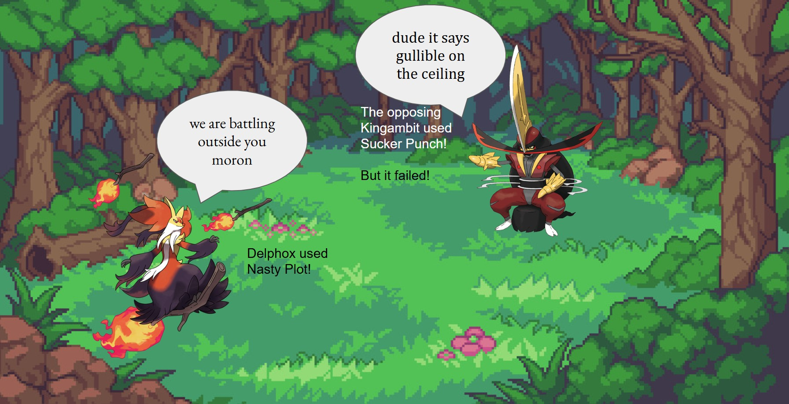
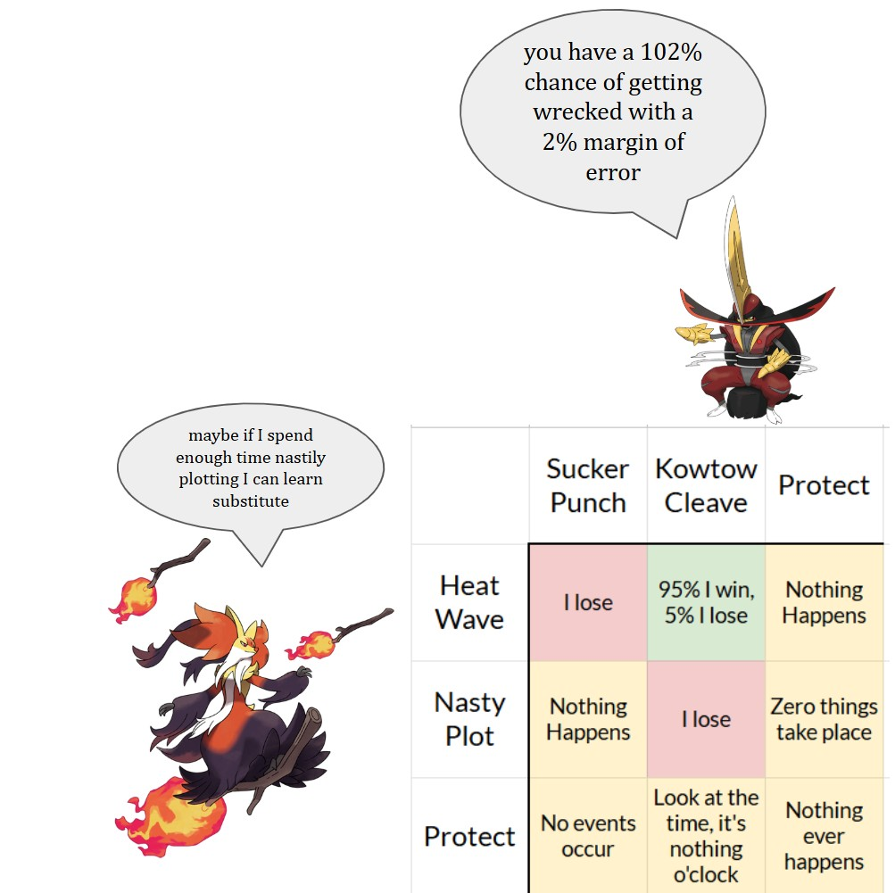
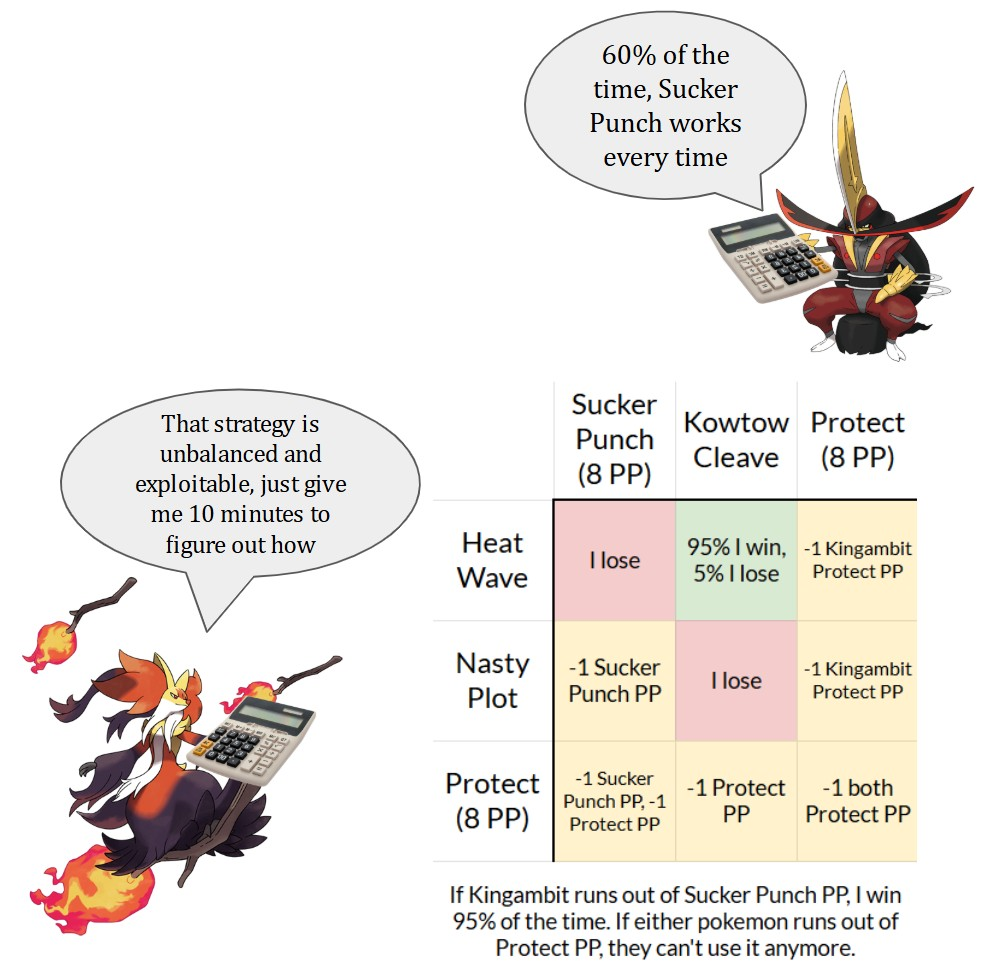
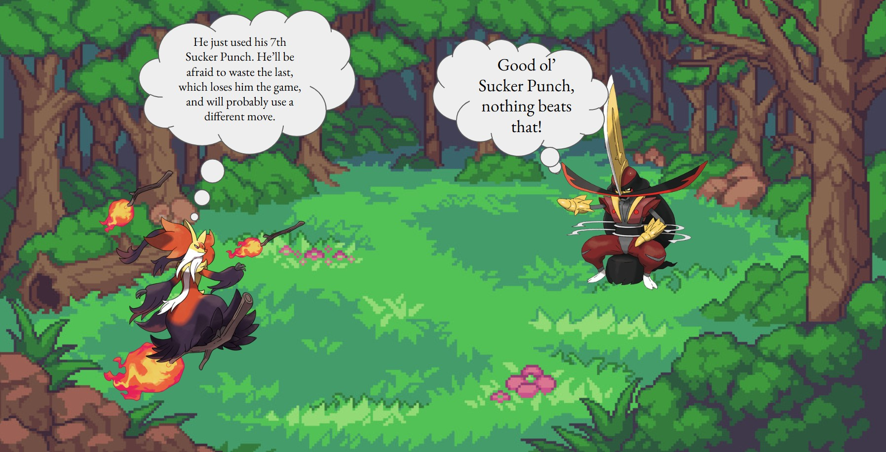
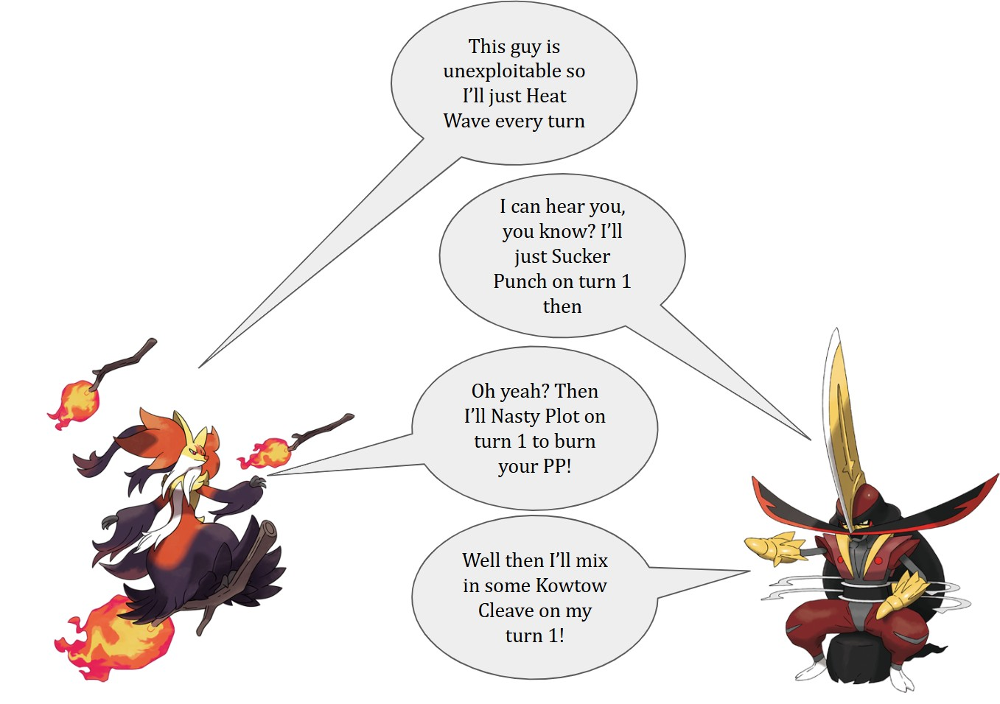

# The Sucker Punch problem, part 2

While playing Pokemon Champions, I stumbled upon this endgame situation(recreated here):

For those that don't play Pokemon, me and my opponent are now guessing each other's moves to determine who wins the game.
## The Incident
Due to a series of questionable decisions, this endgame consists of my Mega Delphox against my opponent's Kingambit. These are the last remaining members of our teams, so whoever is KO'd first loses.

My Delphox can use Heat Wave, Nasty Plot, and Protect. [^4th_move1]

Their Kingambit can use Sucker Punch, Kowtow Cleave, and Protect. [^4th_move2]

Here's what all of these moves do:

**Heat Wave:** KOs Kingambit if it used Kowtow Cleave on this turn. This move has a 5% chance to miss and do nothing.

**Nasty Plot:** Does nothing.

**Protect:** Delphox is safe from Sucker Punch and Kowtow Cleave this turn. If this move is used successfully multiple times in a row, the 2nd has only a 1/3 chance to succeed, the 3rd has a 1/9 chance to succeed, and so on, dividing the success rate by 3 until it fails or another move is used, both of which set the success rate back to 100%.

**Sucker Punch:** Kingambit will move before Delphox and KO it, but only if it used Heat Wave.

**Kowtow Cleave:** Kingambit will move after Delphox and KO it if Delphox's move didn't kill Kingambit. This occurs when Delphox uses Heat Wave and misses, Delphox uses Nasty Plot, or if Delphox tries to use Protect and fails.

**Protect:** Kingambit is safe from Heat Wave this turn. This move fails when used multiple times in a row in the same way as Delphox's Protect.

Each turn, I choose Delphox's move and my opponent chooses Kingambit's move. We don't know what the other picked until  all decisions for the turn are in. Here's every combination of things that can happen:

It looks like I've already lost, because my only win condition is for Delphox to successfully use Heat Wave, and there's nothing stopping my opponent from using Sucker Punch to stay safe forever.

Or is there?

## My opponent has PP issues
Kingambit can't use Sucker Punch forever.

Every move in Pokemon has a fixed quantity of Power Points(PP). Using a move consumes 1 PP for that move, and a Pokemon that has run out of PP for a certain move can't use it anymore. As such, if I am able to use non-attacking moves on the turns that Kingambit uses Sucker Punch, then eventually Kingambit will run out of PP for Sucker Punch and lose, as then I can use Heat Wave with no risk.

Here's the situation for both Pokemon:

|Move Name|PP Amount|Does it matter?|
|--|--|--|
|Heat Wave|12|**No**, as outside extremely unlikely multi-protects and repeated misses 12 is enough to outlast 8 Protects, and the game will end whenever Delphox tries to use Heat Wave and Kingambit doesn't Protect|
|Nasty Plot|20|**No**, 20 Nasty Plots will always outlast Kingambit's 8 Sucker Punches and 8 Protects|
|Delphox's Protect|8|**Yes**, as every Protect can possibly burn an opposing Sucker Punch PP and has no risk outside of making another Protect riskier|
|Sucker Punch|8|**Yes**, stalling Kingambit out of Sucker Punches is the primary threat Delphox has|
|Kowtow Cleave|12|**No**, as the game will end whenever Kingambit uses Kowtow Cleave unless Delphox uses Protect, and 12 Kowtow Cleaves outlast 8 Protects|
|Kingambit's Protect|8|**Yes**, as Kingambit can use Protect to risklessly try to burn Delphox's Protects, and if Delphox is out of Protects then Delphox can't stall Sucker Punch without risking Kowtow Cleave|

Our payoff matrix now looks like this:

This is substantially better for Delphox than the initial situation suggests. Delphox now has a reasonable path to victory: dodge Sucker Punches with Nasty Plot and Protect, dodge Kowtow Cleave with Protect, and eventually find a window to use Heat Wave and win. The odds are skewed far in Kingambit's favor due to Sucker Punch being both possibly game-winning and riskless though. How far in Kingambit's favor is it really?

## Prior Work
A simplified version of this has been studied in [this forum post](https://www.smogon.com/forums/threads/there-is-no-way-to-outplay-sucker-punch.3733939/) and [this video](https://youtu.be/M2VI9FTzHQY), featuring the situation where neither Pokemon has Protect. In this case, the game will always end when Kingambit uses Kowtow Cleave(either the opposing pokemon attacked and won, or didn't attack and lost), so the player with Kingambit has 9 possible decisions, corresponding to the number of times Kingambit uses Sucker Punch(0-8) before attempting a Kowtow Cleave. The other player must correctly call the exact number of Sucker Punches to win[^elaboration], resulting in an 8/9 (88.88%) chance of Kingambit winning.

With Protect on both sides, the situation becomes much more complicated. Delphox now can use Protect in the hopes of burning a Sucker Punch PP without losing to Kowtow Cleave. Kingambit can use Protect instead of Sucker Punch to conserve PP while not losing to Heat Wave. Both of these moves also only have 8 PP themselves, and have a chance ot fail if used multiple times in a row, so neither player can rely on them forever.

## What do I do?

In the actual game, I stalled 7 Sucker Punches with Nasty Plots and Protects and then decided to use Heat Wave. Delphox ate the 8th Sucker Punch and I lost. But what was the optimal strategy?

We can figure this out by working backwards. Kingambit with 0 Sucker Punch PP loses 95% of the time, and there is no calculation required to see this. As such, if neither Pokemon can Protect and Kingambit has 1 Sucker Punch remaining, then Kingambit should use Sucker Punch at X probability and Kowtow Cleave the other times. To be unexploitable, Kingambit should choose an X that makes all of Delphox's decisions equally likely to win. 

Delphox's Heat Wave wins at $P= (1-X)(0.95)$ (Kingambit uses Kowtow Cleave and Delphox hits Heat Wave)

Delphox's Nasty Plot wins at $P=(X)(0.95)$ (Kingambit uses Sucker Punch on Delphox's Nasty Plot, then Delphox hits Heat Wave)

Both of these probabilities should be equal, which gives us $X=0.5$ and Delphox has a $0.475$ chance of winning. 
Now that we know this, we can calculate the probability of winning and each player's optimal strategies when Kingambit has 1 Sucker Punch and Delphox has 1 Protect, and Protect hasn't been used last turn. If Kingambit uses Sucker Punch at X probability, then Delphox's 3 options look like this:

Heat Wave: $P = (1-X)(0.95)$ (same as before)

Nasty Plot: $P=(X)(0.95)$ (same as before)
Protect: $P = (X)(0.95) + (1-X)(0.475)$ (Sucker Punch means Kingambit runs out, Kowtow Cleave means Delphox is in the same situation as above, which we calculated at winning = 0.475)

It becomes clear that Delphox should never Nasty Plot(as Protect is always better), and solving for X reveals that Kingambit should Sucker Punch $1/3$ of the time and Delphox has a $0.633$ chance of winning. To find our optimal strategy when everyone has their full PP, we just need to find the probabilities of Delphox winning for every situation that can occur after that full PP turn, and work backwards to find an unexploitable strategy for both players. Let me just pull out a pen and paper, should be about like 10 minutes right? How many game states are there for this scenario?

|Attribute of game state|Number of possibilities|
|--|--|
|Sucker Punch PP Remaining|9 (0 through 8)|
|Delphox's Protect PP Remaining|9|
|Kingambit's Protect PP Remaining|9|
|Delphox's consecutive successful Protects|5 (0 through 4)[^protectcap]|
|Kingambit's consecutive successful Protects|5|
|Total Game States [^totalestimate]|**18225**|

Instead of doing that, we can instead just write a program that solves for it, which I did.

## What was I supposed to do?
At the start of this mindgame, my chance of winning was **15.49%**. Here's a summary of the calculated unexploitable strategies for both players:

|Move|Goes up in frequency when...|Goes down in frequency when...|Frequency on turn 1|Rough range|
|--|--|--|--|--|
|Heat Wave|Kingambit has less Sucker Punches, Delphox just protected|Kingambit just protected|8.7%|3%-50%|
|Nasty Plot|Delphox has low Protect PP, Kingambit has more Sucker Punches, both Pokemon can Protect|Drops to 0% when Delphox just protected if Protect is still available, exactly 1 Sucker Punch remaining|42.4%|4%-85%|
|Delphox's Protect|Kingambit just protected,Delphox just protected with lots of PP leftover, exactly 1 Sucker Punch remaining|Delphox has consecutively protected AND many Sucker Punches remaining, low Protect PP|48.9%|28%-93%|
|Sucker Punch|Delphox just protected, many Sucker Punches remaining|Low Sucker Punches remaining, high PP of all moves|40.1%|15%-85%|
|Kowtow Cleave|Kingambit's Protect frequency goes down|Kingambit's Protect frequency goes up|7.3%|6%-55%|
|Kingambit's Protect|Low Sucker Punches, high general PP|Kingambit just protected, drops to 0% if Delphox just protected|52.5%|15%-69%|

Notably, Delphox should never Nasty Plot after a Protect. I did that in the actual game, so my strategy was exploitable. Oopsie!

## What should *you* do?

If you're ever in this situation against an online opponent, recall what happened in the previous turns and how much PP they have. Accept that you're going to lose the majority of the time and play the best you can. Alternatively, bring Sneasler the next game to avoid having to remember this nonsense.

However, Delphox's unexploitable strategy threatens Heat Wave in every situation at least some percentage of the time, meaning it's always an idea you can do in every situation. If your opponent is playing perfectly unexploitably, then your winrate is the exact same in every situation clicking Heat Wave as any other move the unexploitable strategy recommends[^cavemanstrategy]. As such, if you're in this situation playing against a perfectly unexploitable opponent, save some effort and just attack every turn. You'll get 100% of the expected winrate for 1% of the thinking.

Be careful that your opponent doesn't catch wind of this though, as then you're back to counter-planning each other again!

[^4th_move1]: It also had access to Psychic, but in all situations using Psychic is strictly worse than using Nasty Plot.
[^4th_move2]: I don't actually know if it had Kowtow Cleave, but 97.1% of Kingambit in ranked games have it(according to the in-app battle data on 7/27) so it's pretty safe to assume it did. The Kingambit also revealed Low Kick but it's not relevant here because it's strictly worse than using Kowtow Cleave.
[^elaboration]: The other player also has 9 possible decisions; whatever attacking move they have will end the game regardless of Kingambit's decision, so they're choosing how many times they use a non-attacking do-nothing move before attacking. Suppose Kingambit uses X sucker punches before Kowtow Cleave, and the other player uses Y non-attacking moves before an attack. If X>Y then Kingambit's Sucker Punch will win on turn Y+1, and if X<Y then Kingambit's Kowtow Cleave will win on turn X+1. Only when X=Y will the opponent win by successfully stalling all X sucker punches and then attacking on Kingambit's Kowtow Cleave turn.
[^protectcap]: For this calculation, I made the approximation that the 6th consecutive Protect(5 previously used) and beyond still has a 1/81 chance to succeed, instead of continuing to divide the success probability by 3. This shifts probability calculations by roughly $10^{-11}$ in Delphox's favor. This is an amount so small that I could get this increase in winrate by queueing ranked when it's not raining, which would make myself less likely to get struck by lightning during the game.
[^totalestimate]: This is an overestimate because some states are not reachable, like a Pokemon having used 3 consecutive protects but still having 8 Protect PP, and some states are identical to others, like Kingambit with 0 Sucker Punches and any number of Protects. The adjusted number is still too high to do manually.
[^cavemanstrategy]: If Kingambit is playing unexploitably(and doesn't move to 100% Sucker Punch to exploit you) then on turn 1 Delphox loses 40.1% of the time to Sucker Punch and 0.3% to Kowtow Cleave after missing Heat Wave, wins 7% against Kowtow Cleave, and is blocked by protect 52.5% of the time. If the game reaches turn 2, Delphox will lose 78.9% of the time(from either Sucker Punch or missed Heat Wave+Kowtow Cleave), win 15.3% of the time(either outspeeding a Kowtow Cleave or hitting a failed Protect), and continue to the next turn 5.8% of the time. The win/loss/continue ratios for turn 3 and onwards are roughly the same, and Delphox's overall win probability is 15.49%, exactly the same as if you played unexploitably yourself.